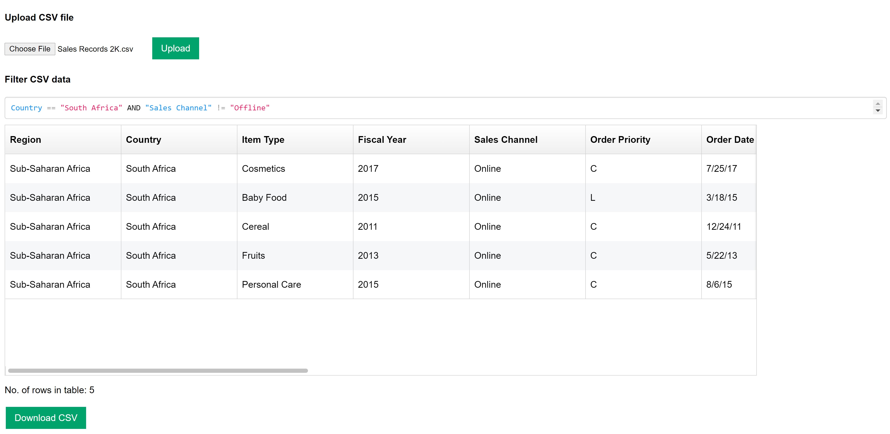

# Articence File Upload and Filter

## Steps to run code
1. Clone the repository to create a local repo.
2. Install dependencies using command `npm install`.
3. To run use command `npm start`.
4. Navigate to **[your_URL_here]/sales** to upload file.

## Screenshot

## External libraries used
1. [react-filter-box](https://github.com/nhabuiduc/react-filter-box)
2. [react-dimensions](https://github.com/digidem/react-dimensions)
3. [papaparse](https://www.papaparse.com/)
4. [fixed-data-table-2](https://github.com/schrodinger/fixed-data-table-2)
 
